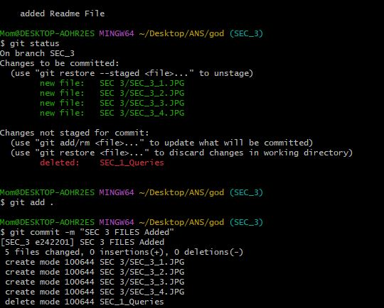
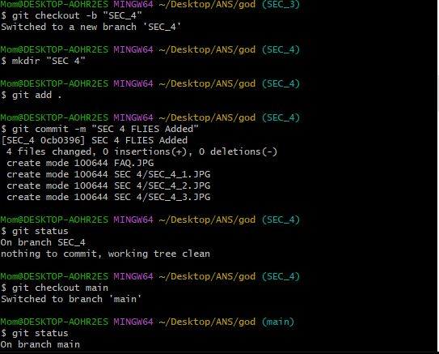
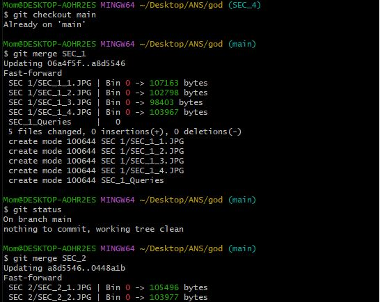
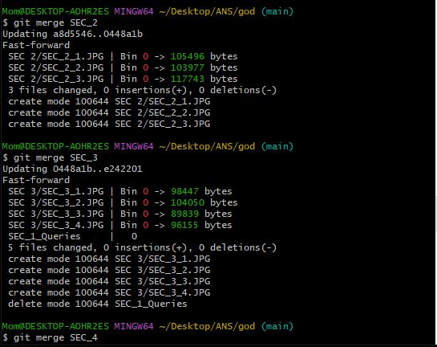
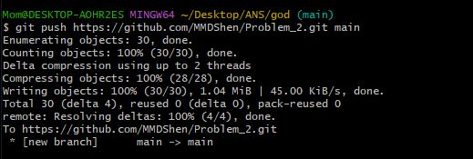
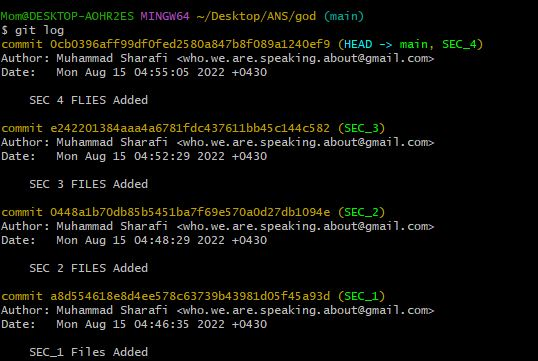

## COMMON STEPS
```
$ git init god/
$ touch readme.md
$ git add .
$ git commit -m "FIRST initialization"
$ git branch SEC_#

# and so on ..
```

## SOME OF IMPORTANT STEPS
1. first i Created folders via

```
$ mkdir "SEC #"
```

command, then adding JPGs and Commited them :
```
$ git add .
$ git commit -m "SEC_# FILES Added"
```
'#' here means the number of sections .

SOURCES:




2. after Adding all of JPGs I Started Merging as Below:

```
$ git merge SEC_#
```
which the SELECTED BRANCH VIA `git checkout BRANCH` command is the main Branch that data comes into it and the SEC_# in Upper COMMAND, is the TARGET which we are transfering its data .

SOURCES:




3. at the end i Pushed Commits to the remot repository:

 ```
 $ git push ADDRESS BRANCH
 ```
 
 SOURCES:
 


4. LOG FILES VIA this Command:
```
$ git log
```



ENDED
